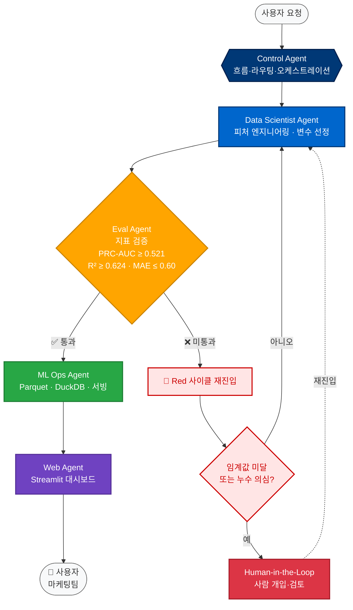

# 에이전트 아키텍처: 제어 에이전트 (Control Agent)

**설계지침서 산출물** — 흐름·라우팅·오케스트레이션 역할

---

## 역할

에이전트 간 실행 순서를 조율하고 태스크를 적절한 에이전트로 라우팅합니다.

---

## 라우팅 규칙

| 입력 태스크 | 담당 에이전트 |
|------------|--------------|
| 데이터 분포 분석, 피처 엔지니어링 | data-scientist |
| 모델 배포, 서빙 환경 최적화 | ml-ops |
| 출력 품질 검증 | eval-agent |
| 대시보드/시각화/사용자 인터페이스 | web-agent |
| 지표 미달 또는 불확실 구간 | human-in-the-loop |

---

## 오케스트레이션 흐름

### 흐름 설명

| 단계 | 에이전트 | 역할 |
|------|---------|------|
| 1️⃣ | **Control Agent** | 작업을 받아 적절한 에이전트로 라우팅 |
| 2️⃣ | **Data Scientist** | 피처 엔지니어링·모델 실험 |
| 3️⃣ | **Eval Agent** | 지표 임계값 검증 |
| 4-A | **ML Ops** (통과) | 서빙 환경 구성 |
| 4-B | **Red 사이클** (미통과) | 재학습 또는 HITL |
| 5️⃣ | **Web Agent** | 결과를 대시보드로 제공 |
| ⚠️ | **Human-in-the-Loop** | 임계값 미달 시 사람 개입 |

---

## 현재 상태

- 수동 오케스트레이션 (`scripts/` 순차 실행)
- 6단계 통합 검증 후 자동화 파이프라인 전환 예정

---

## 관련 문서

- [harness.md](../instructions/harness.md) — 하네스 실행 환경
- [eval-agent.agent.md](eval-agent.agent.md) — 검증 기준
- [HUMAN_IN_THE_LOOP.md](../../docs/HUMAN_IN_THE_LOOP.md) — 개입 설계
