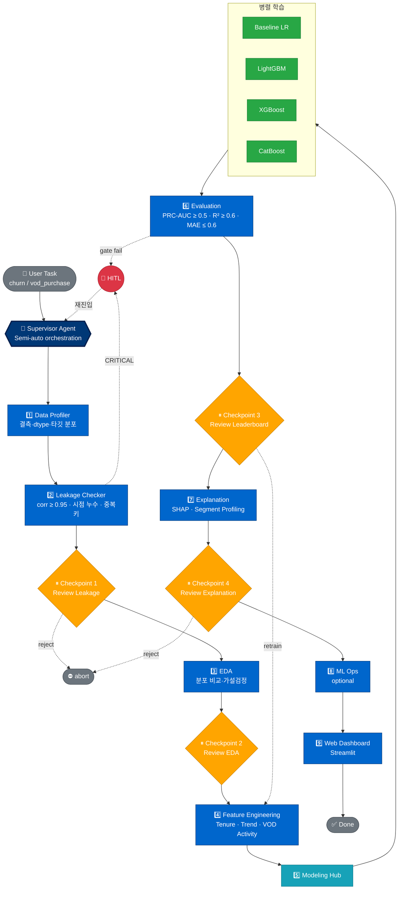

# 에이전트 흐름 (Agent Flow)

> **자동 생성 시점**: 2026-06-20
> **출처**: `.specify/workflows/churn-pipeline/workflow.yml`
> **갱신 규칙**: workflow.yml 변경 시 본 다이어그램도 동기화

11개 에이전트로 구성된 LG헬로비전 해지 예측 파이프라인의 실행 흐름. Semi-auto 모드로 [[supervisor-agent]] 가 오케스트레이션하며, 4개 체크포인트(⏸)와 HITL 트리거(🚨)를 포함한다.

---

## 전체 흐름

---

## 흐름 설명

| 단계 | 에이전트 | 입력 → 산출물 | 라우팅 |
|------|---------|--------------|--------|
| 1️⃣ | Data Profiler | `*_clean.parquet` → `profile.json` | 항상 다음 |
| 2️⃣ | Leakage Checker | profile → `leakage_report.json` | CRITICAL ⇒ 🚨 / WARN ⇒ ⏸1 |
| ⏸1 | (Human) | leakage 검토 | approve ⇒ 3️⃣ / reject ⇒ ⛔ |
| 3️⃣ | EDA | profile + 데이터셋 → `eda_summary.md` | 항상 ⏸2 |
| ⏸2 | (Human) | EDA 인사이트 검토 | 항상 4️⃣ |
| 4️⃣ | Feature Engineering | EDA 인사이트 → `feature_spec.json` + 데이터셋 | 항상 5️⃣ |
| 5️⃣ | Modeling Hub | 데이터셋 → **4모델 병렬 학습** → `leaderboard.csv` | 항상 6️⃣ |
| 6️⃣ | Evaluation | leaderboard → 게이트 검증 | pass ⇒ ⏸3 / fail ⇒ 🚨 |
| ⏸3 | (Human) | 우승 모델 확정 | approve ⇒ 7️⃣ / retrain ⇒ 4️⃣ |
| 7️⃣ | Explanation | winner 모델 → `shap_summary.png` + `explain_brief.md` | 항상 ⏸4 |
| ⏸4 | (Human) | 비즈니스 해석 검토 | approve ⇒ 8️⃣ / reject ⇒ ⛔ |
| 8️⃣ | ML Ops (optional) | winner 모델 → 서빙 패키징 | 항상 9️⃣ |
| 9️⃣ | Web Dashboard | leaderboard + explain → `dashboard/app.py` 갱신 | ✅ Done |

---

## 색상 범례

| 색 | 종류 |
|---|------|
| 🟦 진한 파랑 | Supervisor (오케스트레이터) |
| 🟦 파랑 | 일반 에이전트 |
| 🟨 노랑 | 사람 체크포인트 (⏸) |
| 🟥 빨강 | HITL 트리거 (🚨) |
| 🟩 초록 | 모델 (병렬 학습) |
| 🩵 청록 | 모델링 허브 |
| ⬜ 회색 | 시작·종료·중단 |

---

## HITL 트리거 조건

| 조건 | 발생 단계 |
|------|----------|
| `|corr|` ≥ 0.95 (타깃 누수) | Leakage Checker |
| 시점 누수 (`p_mt` > 기준일) | Leakage Checker |
| `sha2_hash` 중복 | Leakage Checker |
| PRC-AUC < 0.5 (churn) | Evaluation |
| R² < 0.6 또는 MAE > 0.6 (VOD) | Evaluation |
| 체크포인트에서 사람이 `재실행` 요청 | ⏸1~4 |

---

## 관련 문서

- [`supervisor-agent.agent.md`](../.github/agents/supervisor-agent.agent.md) — 오케스트레이션 로직
- [`workflow.yml`](../.specify/workflows/churn-pipeline/workflow.yml) — 파이프라인 정의
- [`HUMAN_IN_THE_LOOP.md`](HUMAN_IN_THE_LOOP.md) — HITL 개입 설계
- [`TDD-ml-cycle.md`](TDD-ml-cycle.md) — Red-Green-Refactor 연결
